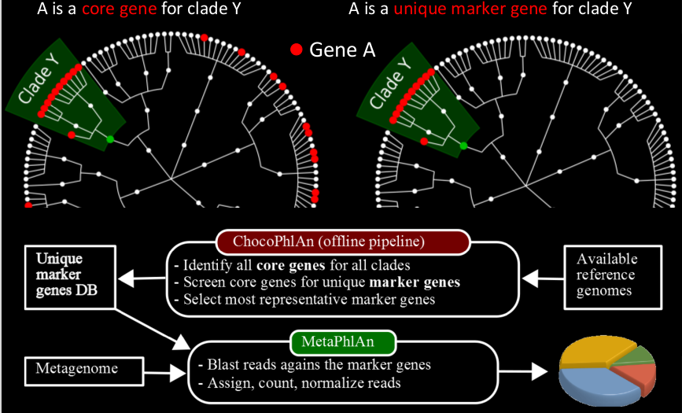
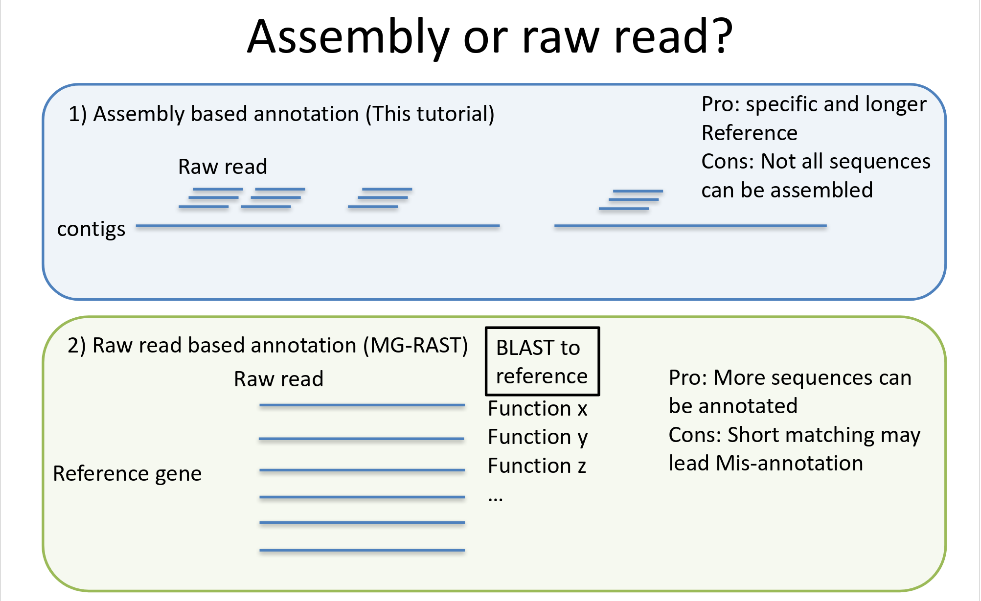
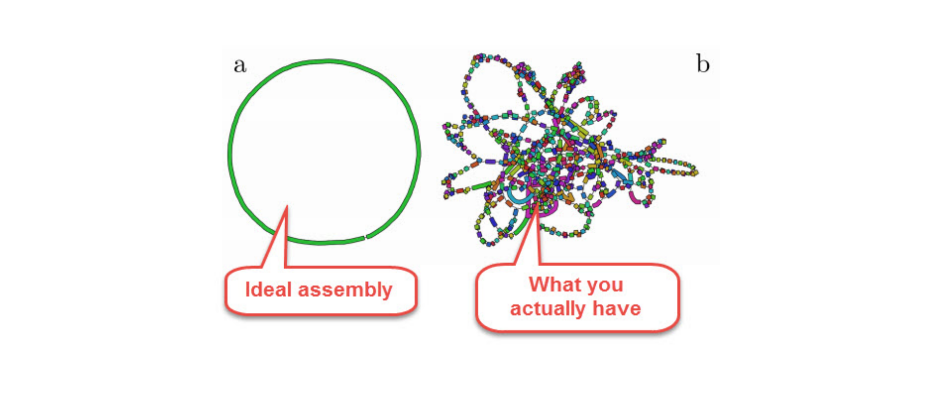

# Shotgun Metagenomics: clase práctica

Antes de empezar la práctica, prepararemos nuestra carpeta de trabajo.

Vamos a dirigirnos a nuestras carpetas personales, en las que hemos estado trabajando

conectarse al servidor con ``ssh``

``cd ~/Desktop/CURSO_BIOINFO/METAGENOMICA/alumnos/NOMBRE``

``ls``

meta_amplicones/

---

``mkdir meta_shotgun && cd meta_shotgun``


> __Shotgun metagenomics.__ The random sequencing of gene fragments isolated from environmental samples, allowing sequencing of uncultivable organisms.

> __Shotgun sequencing.__ DNA is fragmented into small segments which are individually sequenced and then reassembled into longer, continuous sequences using sequence assembly software.


#### Limpieza de reads crudos

Hagamos una liga simbólica de los reads a nuestras carpetas de trabajo

``ln -s ~/Desktop/CURSO_BIOINFO/METAGENOMICA/data/meta_shotgun/* .``

``ls``

gut1_R1.fastq

gut1_R2.fastq

gut2_R1.fastq

gut2_R2.fastq

---

Ahora, vamos a verificar que todos los reads tengan par (para eso primero tenemos que visualizar el header de los archivos)

``less gut1_R1.fastq``

@SRR492065.1 HWI-EAS385_0095_FC:2:1:6702:1434/1
TCAGCCATCGCTATGCTTGGCTTCACTGTGAAGACCACTCCAATCGCGACTTGTCACGATTGTCGTTACCATTAAANNNNNGAAAACAGGAGAACAAGTA
+

---

``grep -c "^@SRR" gut1_R*``

gut1_R1.fastq:100000

gut1_R2.fastq:100000

---

``grep -c "^@M0" gut2_R*``

gut2_R1.fastq:100000

gut2_R2.fastq:100000

---

#### Union de PE reads o saltar el paso?

#### Anotar taxones con reads o con contigs?

>Recuerden que el orden de los pasos sí va a afectar el producto. Para propósitos académicos, vamos a seguir todos los pasos de la metodología:

>Haremos una unión de los reads tipo PE y, con la salida de esos reads, haremos la anotación taxonómica. Después, haremos un ensamble de los reads, validaremos el ensamble y usaremos los contigs para hacer una anotación funcional (aunque ten en cuenta que igual se podría repetir la anotación taxonómica pero con los contigs).


#### Pareado de lecturas

creamos una carpeta de trabajo para pear:

``mkdir pear && cd pear``

para la primera muestra:

``pear -f ../gut1_R1.fastq -r ../gut1_R2.fastq -o gut1_pear``

``ls``

gut1_pear.assembled.fastq

gut1_pear.unassembled.forward.fastq

gut1_pear.unassembled.reverse.fastq

gut1_pear.discarded.fastq

---

y para la segunda muestra:

``pear -f ../gut2_R1.fastq -r ../gut2_R2.fastq -o gut2_pear``

``ls``

gut1_pear.assembled.fastq

gut1_pear.unassembled.forward.fastq

gut1_pear.unassembled.reverse.fastq

gut1_pear.discarded.fastq

gut2_pear.assembled.fastq

gut2_pear.unassembled.forward.fastq

gut2_pear.unassembled.reverse.fastq

gut2_pear.discarded.fastq

---

Ahora verificamos el número de reads que se encuentran en los archivos:

``grep -c "^@SRR" gut*_pear.*``

gut1_pear.assembled.fastq:1897

gut1_pear.unassembled.forward.fastq:98103

gut1_pear.unassembled.reverse.fastq:98103

gut1_pear.discarded.fastq:0

gut2_pear.assembled.fastq:889

gut2_pear.unassembled.forward.fastq:99111

gut2_pear.unassembled.reverse.fastq:99111

gut2_pear.discarded.fastq:0

---

___PREGUNTA: _¿por qué para datos shotgun salieron tantas lecturas unassembled?_, _¿estas secuencias pueden o no pueden usarse?_, _¿por qué?____

---

Para usar todos los archivos como entrada, vamos a comprimir a los mismos en una carpeta tipo .tar.bz2 que llamaremos input1 e input2 (separados por muestreo)

---

``tar -cvjSf input1.tar.bz2 gut1_pear.*ssembled.*``

``tar -cvjSf input2.tar.bz2 gut2_pear.*ssembled.*``

``ls``

gut1_pear.assembled.fastq

gut1_pear.unassembled.forward.fastq

gut1_pear.unassembled.reverse.fastq

gut1_pear.discarded.fastq

gut2_pear.assembled.fastq

gut2_pear.unassembled.forward.fastq

gut2_pear.unassembled.reverse.fastq

gut2_pear.discarded.fastq

input1.tar.bz2

input2.tar.bz2


----

Ahora, vamos a mover las carpetas comprimidas que creamos dentro de otra que vamos a llamar taxonomy

``mkdir taxonomy``

``mv input* taxonomy/.``

``cd taxonomy && ls``

input1.tar.bz2

input2.tar.bz2

---


#### Predicción y anotación taxonómica (¿quién está ahí?) con reads

__Para la anotación taxonómica usaremos el programa [MetaPhlAn2](https://bitbucket.org/biobakery/metaphlan2)__


En la carpeta que acabamos de realizar generaremos la predicción y anotación taxonómica usando MetaPhlAn2, un programa que utiliza una base de datos de marcadores clado específicos para asignar taxonomía (Figura 1): 

---

_NOTA: ¿Recuerdan la lectura obligatoria mencionada en la introducción de los análsis metagenómicos?: [An evaluation of the accuracy and speed of metagenome analysis tools](https://www.ncbi.nlm.nih.gov/pmc/articles/PMC4726098/pdf/srep19233.pdf)_

---



_Figura 1. Diagrama del método de anotación usando marcadores clado específicos que utiliza MetaPhlAn_

---

PREGUNTA: _¿Cómo elegir el mejor programa para anotar taxones en datos metagenómicos?_, _¿Qué otros programas existen para realizar este paso?_, _¿Cuáles son las ventajas y desventajas de cada programa?_

---

Ahora sí, comencemos con la predicción taxonómica y veamos la abundancia relativa de los organismos presentes en la muestra:

Para la primera muestra:

```
tar -xjf input1.tar.bz2 --to-stdout | python ~/Desktop/CURSO_BIOINFO/METAGENOMICA/metaphlan2/metaphlan2.py --input_type multifastq > gut1_taxonomy.txt

```

``mv stdin_map.bowtie2out.txt gut1_map.bowtie2out.txt``

Para la segunda muestra:

```
tar -xjf input2.tar.bz2 --to-stdout | python ~/Desktop/CURSO_BIOINFO/METAGENOMICA/metaphlan2/metaphlan2.py --input_type multifastq > gut2_taxonomy.txt

```
``mv stdin_map.bowtie2out.txt gut2_map.bowtie2out.txt``

---

Veamos los archivos .txt de salida

``less gut1_taxonomy.txt``

> #SampleID       Metaphlan2_Analysis
> k__Bacteria     100.0
> k__Bacteria|p__Firmicutes       86.78502
> k__Bacteria|p__Actinobacteria   13.21498
> k__Bacteria|p__Firmicutes|c__Bacilli    76.57419
> k__Bacteria|p__Actinobacteria|c__Actinobacteria 13.21498
> k__Bacteria|p__Firmicutes|c__Clostridia 10.21083
> k__Bacteria|p__Firmicutes|c__Bacilli|o__Lactobacillales 69.09124
> k__Bacteria|p__Actinobacteria|c__Actinobacteria|o__Actinomycetales      13.21498
> k__Bacteria|p__Firmicutes|c__Clostridia|o__Clostridiales        10.21083
> k__Bacteria|p__Firmicutes|c__Bacilli|o__Bacillales      7.48295
> k__Bacteria|p__Firmicutes|c__Bacilli|o__Lactobacillales|f__Enterococcaceae      69.09124
> k__Bacteria|p__Actinobacteria|c__Actinobacteria|o__Actinomycetales|f__Propionibacteriaceae      13.21498
> k__Bacteria|p__Firmicutes|c__Clostridia|o__Clostridiales|f__Clostridiales_Family_XI_Incertae_Sedis      10.21083
> k__Bacteria|p__Firmicutes|c__Bacilli|o__Bacillales|f__Staphylococcaceae 7.48295


``less gut2_taxonomy.txt``

> #SampleID       Metaphlan2_Analysis
> k__Bacteria     100.0
> k__Bacteria|p__Firmicutes       81.56846
> k__Bacteria|p__Actinobacteria   18.43154
> k__Bacteria|p__Firmicutes|c__Bacilli    77.19391
> k__Bacteria|p__Actinobacteria|c__Actinobacteria 18.43154
> k__Bacteria|p__Firmicutes|c__Clostridia 4.37455
> k__Bacteria|p__Firmicutes|c__Bacilli|o__Lactobacillales 71.35411
> k__Bacteria|p__Actinobacteria|c__Actinobacteria|o__Actinomycetales      18.43154
> k__Bacteria|p__Firmicutes|c__Bacilli|o__Bacillales      5.83979
> k__Bacteria|p__Firmicutes|c__Clostridia|o__Clostridiales        4.37455
> k__Bacteria|p__Firmicutes|c__Bacilli|o__Lactobacillales|f__Enterococcaceae      71.35411
> k__Bacteria|p__Actinobacteria|c__Actinobacteria|o__Actinomycetales|f__Propionibacteriaceae      18.43154
> k__Bacteria|p__Firmicutes|c__Bacilli|o__Bacillales|f__Staphylococcaceae 5.83979
> k__Bacteria|p__Firmicutes|c__Clostridia|o__Clostridiales|f__Clostridiales_Family_XI_Incertae_Sedis      4.37455


__NOTA: Vamos a comparar las abundancias taxonómicas de ambos muestreos:__

Concatenar las tablas de abundancias con un programa de metaphlan (el número de muestras a concatenar es ilimitado, _pueden ser 2, 3, 4 o más_):

```~/Desktop/CURSO_BIOINFO/METAGENOMICA/metaphlan2/utils/merge_metaphlan_tables.py gut*_taxonomy.txt > merged_abundance_table.txt```


``less merged_abundance_table.txt``

> ID      gut1_taxonomy   gut2_taxonomy
> #SampleID       Metaphlan2_Analysis     Metaphlan2_Analysis
> k__Bacteria     100.0   100.0
> k__Bacteria|p__Actinobacteria   13.21498        18.43154
> k__Bacteria|p__Actinobacteria|c__Actinobacteria 13.21498        18.43154
> k__Bacteria|p__Actinobacteria|c__Actinobacteria|o__Actinomycetales      13.21498        18.43154
> k__Bacteria|p__Actinobacteria|c__Actinobacteria|o__Actinomycetales|f__Propionibacteriaceae      13.21498        18.43154
> k__Bacteria|p__Actinobacteria|c__Actinobacteria|o__Actinomycetales|f__Propionibacteriaceae|g__Propionibacteriaceae_unclassified 0.8905  0.0
> k__Bacteria|p__Actinobacteria|c__Actinobacteria|o__Actinomycetales|f__Propionibacteriaceae|g__Propionibacterium 12.32448        18.43154
> k__Bacteria|p__Actinobacteria|c__Actinobacteria|o__Actinomycetales|f__Propionibacteriaceae|g__Propionibacterium|s__Propionibacterium_avidum     12.32448        18.43154
> k__Bacteria|p__Actinobacteria|c__Actinobacteria|o__Actinomycetales|f__Propionibacteriaceae|g__Propionibacterium|s__Propionibacterium_avidum|t__Propionibacterium_avidum_unclassified    12.32448        18.43154
> k__Bacteria|p__Firmicutes       86.78502        81.56846
> k__Bacteria|p__Firmicutes|c__Bacilli    76.57419        77.19391
> k__Bacteria|p__Firmicutes|c__Bacilli|o__Bacillales      7.48295 5.83979
> k__Bacteria|p__Firmicutes|c__Bacilli|o__Bacillales|f__Staphylococcaceae 7.48295 5.83979

---

Por último, nos saldremos de la carpeta de pear (regresaremos a la carpeta de meta_shotgun)

``cd ../..``

``pwd``

#### Ensamble

Hay que recordar que no esperamos un gen específico (como era el caso de los amplicones) ni tampoco un genoma específico, sino un pedacerío del genoma de muchos organismos__, la mayoría no descritos en base de datos__. Tener secuencias más largas antes de la anotación, a través de un ensamble... o anotar con reads tiene sus ventajas y desventajas (_Figura 2_).



_Figura 2. Ventajas y desventajas de anotaciones con reads o con ensambles_


__Generaremos un ensamble con [megahit](http://www.metagenomics.wiki/tools/assembly/megahit):__

para la primera muestra:

```
megahit -1 gut1_R1.fastq -2 gut1_R2.fastq --k-min 51 --k-max 127 -o gut1_assembly
```

y para la segunda muestra:

```
megahit -1 gut2_R1.fastq -2 gut2_R2.fastq --k-min 51 --k-max 127 -o gut2_assembly
```

Dejemos correr al programa y cuando termine, veamos el resultado del ensamble

``less gut1_assembly/final.contigs``

``less gut2_assembly/final.contigs``

Vamos a crear una carpeta donde guardaremos las salidas de los ensambles

``mkdir megahit``

``mv gut1_assembly/ megahit/.``

``mv gut2_assembly/ megahit/.``

Y copiaremos el archivo de contigs finales a la carpeta de trabajo de meta_shotgun (cambiando sus nombres para reconocerlos)

``cp megahit/gut1_assembly/final.contigs.fa gut1.contigs.fa``

``cp megahit/gut2_assembly/final.contigs.fa gut2.contigs.fa``

``ls``

gut1.contigs.fa

gut1_R1.fastq

gut1_R2.fastq

gut2.contigs.fa

gut2_R1.fastq

gut2_R2.fastq

megahit/

pear/

---

__ El siguiente paso será el de eliminar los contigs estén muy cortos__

Haremos un filtro de contigs, eliminando aquellos con una longitud menor a 500 pb. Para lo anterior, usaremos un script que habrá que copiar a la carpeta en la que estamos parados (donde están nuestros contigs finales)

``cp ~/Desktop/CURSO_BIOINFO/METAGENOMICA/assem_filter.pl .``

``perl assem_filter.pl gut1.contigs.fa 500``

``perl assem_filter.pl gut2.contigs.fa 500``

``ls``

assem_filter.pl

filtered_500_gut1.contigs.fa

gut1.contigs.fa

gut1_R1.fastq

gut1_R2.fastq

filtered_500_gut2.contigs.fa

gut2.contigs.fa

gut2_R1.fastq

gut2_R2.fastq

megahit/

pear/

----


Vamos a ver cuántos reads fueron eliminados (cuántos reads tenían una longitud menor a 500 pb) en este paso.

`` grep -c "^>" gut*.contigs.fa``

gut1.contigs.fa:844
gut2.contigs.fa:302

`` grep -c "^>" filtered_500_gut*.contigs.fa``

filtered_500_gut1.contigs.fa:149
filtered_500_gut2.contigs.fa:66

---

#### Validación de ensamble:

__Vamos a crear una carpeta de valoración del ensamble__

Asegúrate de estar parado en la carpeta shotgun que hicimos al principio de la práctica

``pwd``

Una vez ahí, realicemos una carpeta para la valoración del ensamble y generemos una liga simbólica a los cotigs finales de megahit y también a los contigs que filtramos con el script

``mkdir assessment && cd assessment``

``mv ../filtered_500_gut*.contigs.fa . && ls``

filtered_500_gut1.contigs.fa

filtered_500_gut2.contigs.fa

---

__La valoración la realizaremos con el programa quast__ (recuerden que ya usaron este programa antes en la unidad de genómica), usando como input a los contigs que creamos con  megahit y como output obtendremos un reporte en un archivo de texto

``quast.py filtered_500_gut1.contigs.fa -o gut1_assemble_report``

``quast.py filtered_500_gut2.contigs.fa -o gut2_assemble_report``

``ls``

filtered_500_gut1.contigs.fa

filtered_500_gut2.contigs.fa

gut1_assemble_report/

gut2_assemble_report/

---

Veamos el reporte

``less gut1_assemble_report/report.txt``

``less gut2_assemble_report/report.txt``

> N50 debe ser un número alto
> L50 es el número de cóntigs con longitud igual o mayor a la N50. En otras palabras, es el número mínimo de contigs que cubren la mitad del ensamble. Entre más pequeño el número, mejor (aunque en metagenomas de muestras muy muy complejas, eso sería muy difícil):



__Elegir un ensamble de mayor o mejor calidad sólo podría tener sentido al comparar varios ensambles entre sí:__

por lo que vamos a hacer el paso anterior pero comparando los contigs finales antes y después de eliminar las lecturas menos de 500 pb

---

> __NOTA: Aquí lo ideal sería comparar los contigs finales de ensambles realizados con diferentes programas (por ejemplo, IDBA y megahit)__

---

``mv ../gut*.contigs.fa .``

``quast.py gut1.contigs.fa filtered_500_gut1.contigs.fa -o gut1_compare_report``

``quast.py gut2.contigs.fa filtered_500_gut2.contigs.fa -o gut2_compare_report``

``ls``

filtered_500_gut1.contigs.fa

filtered_500_gut2.contigs.fa

gut1_assemble_report/

gut2_assemble_report/

gut1_compare_report/

gut2_compare_report/

---

Veamos el reporte

``less gut1_compare_report/report.txt``

``less gut2_compare_report/report.txt``

``cd ..``

---


#### Predicción y anotación funcional (¿qué están haciendo -potencialmente-?)

__PREDICCIÓN DE MARCOS DE LECTURA ABIERTOS__

El último paso del workflow general sería el de anotar los genes. Para completar el paso, se debe empezar por reconocer las secuencias con marco de lectura abierto dentro de tus reads totales. O sea, encontrar sólo las secuencias que posiblemente se expresen en proteínas.

[MetaGeneMark](http://exon.gatech.edu/GeneMark/license_download.cgi) es un programa que filtra los contigs, reconociendo sólo las secuencias codificantes (elimina incluso los pseudo genes) diseñado para datos metagenómcos.

``mkdir orfs && cd orfs``

``mv ../assessment/filtered_500_gut*.contigs.fa . && ls``


Ahora sí corramos el programa de predicción de marcos de lectura:

para la primera muestra:

```~/Programs/MetaGeneMark/mgm/gmhmmp -d -D gut1.nt -a -A gut1.aa -f G -m ~/Programs/MetaGeneMark/mgm/MetaGeneMark_v1.mod filtered_500_gut1.contigs.fa -o gut1.contigs.gff```

para la segunda muestra:

```~/Programs/MetaGeneMark/mgm/gmhmmp -d -D gut2.nt -a -A gut2.aa -f G -m ~/Programs/MetaGeneMark/mgm/MetaGeneMark_v1.mod filtered_500_gut2.contigs.fa -o gut2.contigs.gff```

---

``less gut1.aa``


__ANOTACIÓN DE GENES / BASE DE DATOS DE KEGG:__

[GhostKOALA](https://www.kegg.jp/ghostkoala/)

Para pedir un proyecto de anotación a GhostKOALA, se necesita subir el archivo de amino ácidos en formato fasta (gut*.aa) de salida de MetaGeneMark, así que lo descargaremos en nuestras computadoras:

``scp SERVIDOR:~/Desktop/CURSO_BIOINFO/METAGENOMICA/alumnos/NOMBRE/meta_shotgun/orfs/gut1.* .``

Y abriremos la página del link adjunto arriba, cargaremos el archivo .aa y someteremos un proyecto con nuestros correos electrónicos. Generalmente tardan un día, aprox, en mandarte tus resultados.

