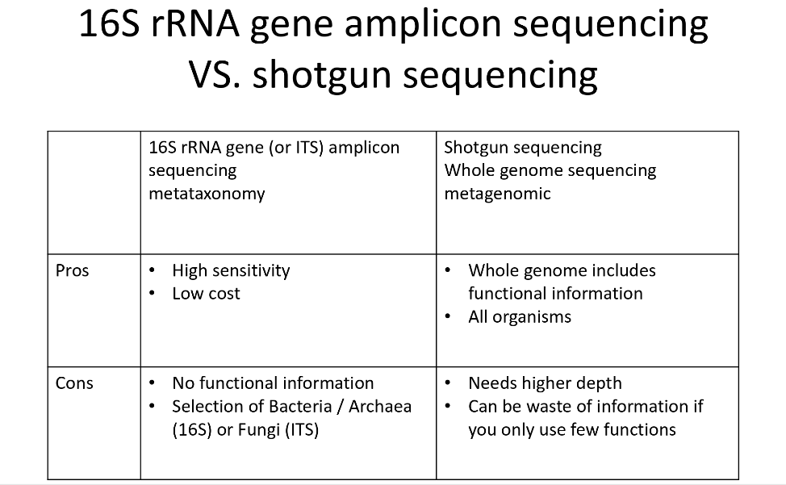

# 4. Introducción a la Metagenómica

#### 4.1. Metagenómica: ¿qué es y para qué sirve?

La metagenómica se ha definido como "el análisis genómico de microorganismos" por extracción directa y clonación de ADN de una comunidad o una muestra de un agregado de microorganismos ([Handelsman 2004](http://citeseerx.ist.psu.edu/viewdoc/download?doi=10.1.1.333.6836&rep=rep1&type=pdf)). Uno de los trabajos pioneros en el análisis de metagenómica se realizó por [Venter et al.](http://science.sciencemag.org/content/304/5667/66) en el Mar de los Sargazos.

__La metagenómica permite acceder al genoma sin ver a los microorganismos ni cultivarlos__. 

_Figura 1. Esquema de la toma de decisiones involucradas en los proyectos de biología molecular clásicos. Las muestras pueden colectarse de una variedad de ambientes usando las técnicas apropiadas de colecta. El ADN es subsecuentemente preparado y secuenciado para su posterior anotación. Los resultados serán usados para contestar una variedad de preguntas ecológicas y evolutivas (en muestreos tomados a lo largo del tiempo y comparados entre sí) ([Creer et al., 2016](https://besjournals.onlinelibrary.wiley.com/doi/pdf/10.1111/2041-210X.12574))._

---

Esta posibilidad de secuenciar directamente los genomas de microorganismos sin necesidad de cultivarlos abre nuevas posibilidades que suponen un cambio de rumbo en la Microbiología. Esta herramienta ha generado una __revolución científica__ debido a su alto rendimiento y gran potencial a un bajo costo.

Uno de los objetivos más importantes de los estudios metagenómicos es __la caracterización completa de una comunidad__, por lo que generalmente se requieren esfuerzos para comprender:

1. La composición/estructura de la comunidad, incluyendo el desglose taxonómico y la abundancia relativa de las diversas especies.
2. La contribución génica de cada miembro de la comunidad, incluyendo el número y capacidad funcional
3. La heterogeneidad de los genes dentro de la especie o dentro de la población.

> "To date, only 5% of the estimated number of bacterial species has been documented. Metagenomics studies have improved our understanding of the diversity of microbes in various habitats. This includes microbes associated with organisms as endophytes. These microbes can have beneficial, neutral, or detrimental effects on the overall health of the organism. The association between microbiota and their host is important, as it leads to understanding microbes and _“What are they doing and how do they respond to environmental changes and interact with each other?”_".

>“Hoy en día usamos, sobre todo, a la metagenómica como la estrategia para el estudio de los ambientes marinos y costeros hipersalinos. Esta estrategia tendrá sin duda un impacto profundo en el estudio de la diversidad de procariotas, las perspectivas del medio ambiente y la población” - [Dr. Francisco Rodríguez Valera, investigador del grupo de Genómica Evolutiva de la Universidad Miguel Hernández, San Juan de Alicante](https://www.agenciasinc.es/Reportajes/Metagenomica-la-microbiologia-del-futuro).

### 4.2. Tipos de datos metagenómicos: amplicones vs. shotgun

La principal variante de laboratorio para obtener una comparación entre muestreos metagenómicos se observa en el tipo de datos moleculares que se utilizan para el estudio: __diferentes tipos de _amplicones_ o _datos tipo shotgun___.

__Los amplicones son muy útiles__ cuando se desea únicamente conocer la __presencia o ausencia de organismos en la comunidad muestreada__,  así como los __índices de diversidad taxonómica__ de dichos organismos ([Kreisinger et al, 2017](https://www.frontiersin.org/articles/10.3389/fmicb.2017.00050/full)). Las __ventajas al usar marcadores conocidos__ para estos estudios __es lo bien anotadas que están las bases de datos y la cantidad de [programas especializados](http://qiime.org/) que existen para generar los resultados sin quimeras (Tabla 1)__.

| Target        | Gen/Región         | Base de Datos                |
| ------------- |:------------------:| ----------------------------:|
| Bacteria      |         16S        | RDP,Greengenes, SILVA        |
| Arquea        |         16S        | RDP,Greengenes, SILVA        |
| Fungi         |      ITS, 18S      | UNITE, GenBank, BOLD, SILVA  |
| Protistas     |    ITS, 18S, COI   | SILVA, GenBank, BOLD         |
| Macrofauna    | COI, 16S, 12S, 18S | BOLD, GenBank                |
| Plantas       |  matK, + rbcL, ITS | BOLD, GenBank                |

_Tabla1. Diferentes tipos de marcadores usados en metagenómica en el estudio con amplicones ([Creer et al., 2016](https://besjournals.onlinelibrary.wiley.com/doi/pdf/10.1111/2041-210X.12574))._

---

__Sin embargo__, los amplicones __no permiten observar el potencial metabólico de la comunidad. Para tener esa información__  biológica, se requiere todo el ADN de todos los organismos en la muestra: [datos tipo shotgun](http://aura.abdn.ac.uk/bitstream/handle/2164/10167/NBT_R37313C_line_edit_SJ_1493899923_1_final_for_self_archiving.pdf;jsessionid=C45D00AB0C30FC2EF360229FB772C121?sequence=1).

> "shotgun  metagenomics, is the untargeted (“shotgun”) sequencing of all (“meta”) of the microbial genomes (“genomics”) present  in  a sample" 

Idealmente, a partir de datos metagenómicos tipo shotgun, uno sería capaz inclusive de reconstruir completamente todos los genomas dentro de una muestra dada. Sin embargo, este objetivo particular ha sido en gran medida inalcanzable debido a limitaciones tecnológicas en el aislamiento bacteriano/recuperación del ADN total de un muestreo, así como en la capacidad de secuenciación (costo y rendimiento). ([Scholz, 2012](https://www.sciencedirect.com/science/article/pii/S0958166911007245)). Hasta ahora, sólo se ha podido reconstruir (a partir de inferencias) los genomas de los microorganismos más abundantes (con mayor repetido de lecturas en  la secuenciación) en una muestra poco compleja o con una cantidad total de reads muy alta. _Lectura recomendada [aquí](http://science.sciencemag.org/content/335/6068/587.abstract)_

_Tabla 2. Tabla comparativa entre las ventajas y desventajas de la metagenómica de amplicones y tipo shotgun_

### 4.2.1. Una pequeña historia de la biología molecular y la identificación de taxones.

El uso de moléculas taxonómicamente informativas ha sido clave para establecer un entendimiento básico pero robusto de la filogenia de la vida y para hoy en día poder comprender (usando los esfuerzos del pasado) la mayoría de la diversidad del mundo no caracterizada.

Los trabajos clásicos se enfocaban, primordialmente, en genes codificantes a subunidades de rRNA ribosomal como __ortógolos universales__ (ver glosario de palabras) extraídos de organismos no clasificados pero aislados de manera tradicional (aislando cepas con métodos de cultivo tradicionales).Subsecuentemente, los primeros estudios de ADN aislado directamente del ambiente (muestra de suelos o de agua marina, por ejemplo) utilizaban estas mismas moléculas para anotar/posicionar a organismos nuevos (sin ningún paso clásico de laboratorio de caracterización o aislamiento) dentro de un marco evolutivo (un árbol) y de esta manera hemos confirmado la extraordinaria diversidad de organismos no caracterizados e imposibles (hasta ahora) de aislar con métodos tradicionales.

### 4.3. Workflow básico

__Workflow muy general (en lo que ambos métodos convergen)__

_Figura 2. Workflow de procesamiento de datos metagenómicos básico_

__Diferencias en los análisis de datos de amplicones y shotgun__

_Figura 3. Diferencia escencial entre los análisis de metabarcoding y shotgun metagenomics_

#### 4.3.1. __Si enlistamos entonces, los pasos básicos de análisis:__

---
1. Muestreo y selección del método de secuenciación
2. Reads crudos (_pasos previos para verificar que se secuenció lo que querías, __específicamente para datos de amplicones - de 16S, por ejemplo__ - es buen ejercicio verificar qué región hipervariable secuenciaron_)
3. Limpieza de reads
4. Ensamble (_para __shotgun___) / pareamiento de lecturas PE
5. Eliminación de quimeras (_para __amplicones___)
6. Anotación taxonómica
7. Anotación  funcional (únicamente shotgun)
8. Perfil de abundancias de taxones/genes comparada (varias muestras o la misma en el tiempo)

NUEVAS OPORTUNIDADES EN LA METAGENÓMICA (únicamente __shotgun__):

1. Inferencia de genomas
2. Inferencia de nuevas rutas metabólicas
3. Estudios de interacciones (teoría de redes)
---

#### A) Muestreo y selección de método de secuenciación

___¿dónde creen que empiezan las fuentes de error y limitantes más grandes a la hora de interpretar los datos?___

_... sí, en el muestreo y la extracción de ADN_

Los errores que parecieran ser menos evidentes, se generan al intentar comparar tus datos con datos públicos similares en muestreos o incluso al comparar tus propias muestras...

En  la etapa de interpretación de resultados se puede dar uno cuenta (demasiado tarde) de que un origen de error se encuentra en que __los paŕametros de metadata (parámetros ambientales) son heterogéneos__.

Los repertorios de datos metagenómicos han intentado establecer anotaciones de metadata universales; sin embargo, aún no existen parámetros establecidos y homogéneos por sitios de muestreo específicos (o sea, parámetros universales que deben medirse en muestras de microbioma y parámetros universales que deben medirse en muestras de suelos o aguas continentales, etc). Esto genera un problema porque la interpretación de los resultados de datos metagenómicos es muy dependiente de la información ambiental que se tenga. Muchas veces, incluso el mismo alumno/investigador no tiene un muestreo de parámetros ambientales profundo (que revele mucha información) y homogéneo para todas sus salidas a muestrear.

> __TIPS PARA REALIZAR MUESTREOS HETEROGÉNEOS: 
> 
> Todos los muestreos deberán diseñarse a partir de la pregunta biológica a contestar__. Sin embargo, se pueden mencionar puntos generales importantes a considerar. Por ejemplo, que el muestreo sea del __mismo tipo de datos__ (microbiomas de un órgano específico o muestras de suelos con parámetros ambientales similares) __o datos contrastantes__ (microbiomas de diferentes órganos o diferentes individuos o muestras de suelos con parámetros ambientales contrastantes, geográficamente distantes o en diferentes tiempos). Por lo antes mencionado, se retoma la importancia de que todos los muestreos, tanto propios como obtenidos de bases de datos, tengan __metadata anotada de manera homogénea, así como que hayan sido secuenciados con la misma plataforma de secuenciación__ (por ejemplo, Illumina 2x300) y los datos procesados de manera homogénea.
> 
> __Repertorio de datos metagenómicos y su metadata:__
>
> * [Dryard](http://datadryad.org/)
> * [MG-RAST](https://www.mg-rast.org/)

Otro punto importante en las condiciones de las muestras es la época del año o temporada en la que se llevo acabo la colecta de la muestra (primavera, verano, otoño e invierno), y más si queremos que el estudio sea reproducible. También puede considerarse importante la forma en la que se transporta la muestra y su almacenamiento hasta poder ser procesada, así como el método con el cuál se procesó la muestra. Si se somete la muestras a diferentes condiciones es posible que los resultados sean diferentes, así como si se obtienen los datos biológicos con diferentes métodos. Este error se puede observar aún cuando la muestra sea del mismos sitio ([Coissac et al. 2012](https://onlinelibrary.wiley.com/doi/abs/10.1111/j.1365-294X.2012.05550.x)). 

__Una fuente de error__ en el proceso de secuenciación que no es tan evidente al interpretar los resultados y hacer las comparaciones por muestreo, __es la covertura de secuenciación de los datos y la complejidad de la comunidad muestreada__ (si tienes cinco muestras muy complejas secuenciadas en una sola placa de Illumina tendrás menos reads por muestra que si las secuencías en placas separadas). Como ya mencionamos, el [método de secuenciación y la longitud de los reads](https://www.illumina.com/systems/sequencing-platforms/miseq/specifications.html) generará muchas diferencias en las muestras que serán independientes de la información biológica de la comunidad. Si no se tiene eso en cuenta, al comparar la diversidad de un muestreo complejo con millones de reads contra un muestreo complejo con sólo miles de reads, se observará más diverso el de millones y menos diverso el de miles y no necesariamente porque hayan más organismos diferentes en el primero y menos en el segundo. __Una manera de evitar el error al inferir índices de diversidad, es normalizar los datos__ para que todos sean comparables, independientemente de la diferencia en el número de reads.

A lo anterior le sigue la __extracción del material genético__, es importante que todas las muestras se obtengan con __un mismo método de extracción__ bien determinado/caracterizado, __para poder tener la misma calidad en todas las muestras__ (pensar bien en la homogenización de la muestra y vonsiderar los mismos parámetros los muestreos que se pretenden comparar). Una vez realizada la extracción del material genético, se tiene que verificar la integridad del mismo en todas las muestras, ya que si alguna se encuentra degradada, la calidad y veracidad de los datos tendrá errores que afectarán nuestra interpretación.

#### B) Reads crudos (previo a la manipulación de los reads _para amplicones_)

En análisis de metabarcoding, incluso antes de mandar a secuenciar, habremos decidido qué marcador molecular es el que más nos conviene. Los ITSs, 18S y 16S son los marcadores más comunmente secuenciados en proyectos de metagenómica _¿por qué creen que sea esto?_, _¿qué tipo de información te dan estos marcadores?_, _¿qué tipo de respuestas se suelen buscar en los proyectos que necesitan de metodologías de metagenómica?_.

Supongamos que elegimos la región hipervariable 4 del gen rARN 16S para hacer una descripción de las bacterias y arqueas de un muestreo particular. Mandamos el ADN ambiental y le pedimos a la empresa de secuenciación que realicen las PCRs de nuestra región del marcador y secuencíen. Antes de empezar a incluso ver la calidad de las secuencias, una buena práctica sería la de verifiacr que los datos que obtuviste, son lo que pediste.

_Figura 1. Diagrama del gen 16S rRNA para una amplificación de PCR de la región hipervariable V4_

El siguiente paso sería el de __descargar una secuencia de GeneBank de un gen 16S completo__ y confiable __y realizar un alineamiento del gen completo con tus reads__. El output del alineamiento indicaría de qué pb a qué pb alinearon tus reads con la secuencia del gen completo. Si el alineamiento coincide con la posición del V4 (600 pb a 900 pb, aprox), entonces confirmaríamos que tenemos los resultados de secuenciación que pedimos.

Un dato también __muy importante__ a considerar antes de mandar a secuenciar, específicamente si optas por trabajar con lecturas tipo peared end, es que exista un sobrelape intermedio entre los reads para parearlos sin error y tener, como resultado, las regiones hipervariables completas y sin gaps. Usando el mismo ejemplo de arriba,  el total de pb esperado máximo de la secuencia del V4 sería de 300 pb. El método de secuenciación de nueva generación que produce los reads más largos hoy en día (_con menos errores_) es el de Illumna PE 2x300. Sin embargo, para este caso en particular, las lecturas 2x200 podrían servir perfectamente (_proporcionando un espacio de sobrelape de 100 pb_) a un menor costo.

#### C) Limpieza de lecturas

Existen muchas herramientas para limpiar los reads de mala calidad, así como eliminar los adaptadores de secuenciación Illumina (por ejemplo), que no son parte de los datos reales de tu muestreo.

Algunos programas de limpieza están creados para tipos de datos específicos al tipo de secuenciación realizada, mientras que otros pueden aceptar varios tipos de datos. De la misma manera, algunos programas están diseñados para realizar un paso muy específico de la limpieza (como eliminar los adaptadores únicamente o eliminar las secuencias con muy baja calidad o eliminar los reads no pareados, __también llamados singletons o huérfanos -ayer los vieron como unpaired reads tras la limpieza de los reads con trimmomatic-__, en reads tipo paired end). Los data sets más comunes son las lecturas tipo PE (ya que Illumina es la opción de secuenciación más popular hoy en día y los PE reads 2x300 son la opción de lecturas más largas que ofrece Illumina).

> NOTA: Como buen hábito de todo bioinformático, siempre es bueno leer los manuales de todos los programas y herramientas/comandos para verificar que estás usando el tipo de input correcto y que el output será exactamente lo que deseas. También es importante verificar por sanidad mental) que la salida de cada paso es la que se supone que tiene que salir (como mínimo haciendo un ``head``, ``tail``, ``more``, ``less``, etc a los archivos finales).

Aquí se enlistan varios:

* [Trimmomatic](http://www.usadellab.org/cms/?page=trimmomatic) - all purpose, removes singleton reads (output singletons free)
* [cutadapt](https://cutadapt.readthedocs.io/en/stable/guide.html) - read adapter and quality trimming
* [sickle](https://github.com/najoshi/sickle) - read quality trimming
* [scythe](https://github.com/vsbuffalo/scythe) - adapter contamination trimming
* [PEAR](https://cme.h-its.org/exelixis/web/software/pear/) - join of paired end reads and read quality trimming

#### D) Pareamiento de lecturas PE o ensamble

__Pareamiento de lecturas en amplicones y o metagenomas__

Este paso sólo se realizará en lecturas de secuenciación Illumina PE. El objetivo de este paso será el de obtener una secuencia pareada más grande (que cubra una porción mayor de las secuencias con las que se compararán y anotarán los reads, y así alcanzar mayor fiabilidad de los resultados).

Un programa muy utilizado para este paso es:

* [PEAR](https://cme.h-its.org/exelixis/web/software/pear/) - join of paired end reads and read quality trimming

__Ensambles en metagenomas (shotgun)__

> Disclaimer: Assembling metagenomes is really difficult and fraught with confounding issues. It was only a few years ago that this was first done for a very simple community that resulted in a paper in Science. You're entering treacherous territory and there will be a lot of time spent assessing your output each step of the way, along with a ton of waiting and re-running things!

Existen muchas opciones para ensamblar datos metagenómicos. Incluso la mayoría de los programas de ensamble de genomas pueden ser usados para ensamblar metagenomas. Aunque también se han diseñado algoritmos específicos para metagenomas (_¿mayor diferencia entre datos de genomas y metagenomas?: __muestras muy diversas con muchos gaps en los genomas de todos___) que parten de no estar diseñados para un sólo organismo sino para muchos en una sola muestra. 

El lema más grande que te tienes que repetir al intentar hacer un ensamble metagenómico es: _"No te desanimes, de por sí es bastante difícil obtener un buen genoma ensamblado de un organismo obtenido de un cultivo puro"

Y el reto se hace mayor y mayor entre más compleja sea tu muestra.

Uno de los ensambladores de metagenomas más nuevo es [Megahit](https://academic.oup.com/bioinformatics/article/31/10/1674/177884)), el cual cuenta con varias ventajas pero una mayor desventaja... _lo dejaré en suspenso porque quiero que lean el artículo adjunto debajo y ustedes sólos contesten el misterio (se los voy a preguntar mañana)_.

__LECTURA OBLIGATORIA: ENSAMBLES (tipos de ensambladores)__ -
[Comparing and Evaluating Metagenome Assembly Tools from a Microbiologist’s Perspective - Not Only Size Matters!](https://journals.plos.org/plosone/article/file?id=10.1371/journal.pone.0169662&type=printable)

#### E) Eliminación de quimeras (para __amplicones__)

__¿Qué es una quimera?__

"ADN diferente en un mismo cuerpo"... o sea, una secuencia del marcador molecular elegido amplificada por error a partir de dos secuencias reales diferentes (de dos organismos). En otras palabras, es una secuencia mezcla de dos o más organismos.

__¿Por qué hay que eliminarlas?__

El objetivo final de los estudios de amplicones es el de describir la diversidad en una muestra. Una secuencia quimérica podría interpretarse como un individuo muy diferente al resto y dar señales muy altas de diversidad falsa.

> "If you are producing amplicons there will always be a certain risk to produce chimeras during the PCR amplification. The sequencing technology that you use afterwards is pretty much irrelevant".

Cuando se realizan los repetidos de marcadores moleculares (amplicones), se generan __errores de amplificación durante el PCR__ que nos podría llevar a interpretaciones erróneas en el análisis de los datos. Los errores generados por PCR incluyen __mutaciones puntuales y formación de moléculas quiméricas__. La tasa de errores de PCR es aproximadamente 10%. Una secuencia de 250 pb contienen uno o más errores cuando se amplifica ([Kobayashi et al. 1999](https://eurekamag.com/research/003/518/003518115.php)). __Se ha demostrado que los errores en la secuenciación incrementan la estimación de la diversidad real en dos órdenes de magnitud__ ([Kunin, 2010](26785201_Kunin_V_Engelbrektson_A_Ochman_H_Hugenholtz_P_Wrinkles_in_the_rare_biosphere_pyrosequencing_errors_lead_to_artificial_inflation_of_diversity_estimates_Environ_Microbiol_12_118)).  __Para amortiguar__ este tipo de errores __lo más importante es usar el [mismo método de secuenciación](https://www.ideals.illinois.edu/bitstream/handle/2142/45490/So%20Youn_Lee.pdf) y un mismo criterio de [limpieza de los datos](https://www.ncbi.nlm.nih.gov/pmc/articles/PMC3051327/)__ para que no hayan variaciones significativas entre muestras. También se pueden considerar diversos programas, como AmpliconNoise, que elimina errores de amplificación por PCR. Y por último, para eliminar secuencias no deseadas en los reads de amplicones, __se han desarrollado programas específicos para detectar secuencias quiméricas generadas por el PCR__. 

#### F) Anotación taxonómica

Existen [varios programas](https://bitbucket.org/biobakery/biobakery/wiki/Home) para realizar diferentes [análisis metagenómicos](https://molbiol-tools.ca/Genomics.htm#Metagenomics). Sin embargo, uno de los pasos medulares __para hacer la comparación en la diversidad taxonómica__ de las muestras es la __predicción de OTUs__. Los programas de predicción taxonómica generalmente cuantifican el número de organismos por muestra (abundancia relativa) tras su identificación. 

En general, __existen dos métodos__ a través de los cuales se identifican los taxones en las muestras metagenómicas ([Lindgreen et al, 2016](https://www.ncbi.nlm.nih.gov/pmc/articles/PMC4726098/pdf/srep19233.pdf); [Teo and Neretti, 2016](https://www.biorxiv.org/content/biorxiv/early/2016/10/15/081141.full.pdf); [Dadi et al, 2016](https://peerj.com/articles/3138/)). __El primer método se basa en preparar una base de datos con secuencias clado específicas__ (secuencias que no comparten regiones con las secuencias de otros clados de la misma jerarquía taxonómica). Con este método se puede garantizar obtener sólo una asignación de clado de una lectura de la muestra, incluso si sólo se usara una fracción de los datos metagenómicos secuenciados. Programas como MetaPhlAn2 ([Truong et al, 2015](https://www.nature.com/articles/nmeth.3589)), GOTTCHA ([Freitas et al, 2015](https://academic.oup.com/nar/article/43/10/e69/2409024)) y mOTUs ([Sunagawa et al, 2013](https://www.nature.com/articles/nmeth.2693)) usan este método. __El segúndo método se basa en el uso de secuencias de referencia__ de una base de datos __para asignarle a las lecturas ambiguas un ancestro común__ (LCA) en un árbol taxonómico. Kraken ([Wood & Salzberg, 2014](https://genomebiology.biomedcentral.com/articles/10.1186/gb-2014-15-3-r46)), un programa de binning de reads por clustering mediante k-meros, es un ejemplo de ese método. En cuanto a las ventajas y desventajas de cada método, el primero es más rápido y preciso pero se limita a las lecturas que pueden ser mapeadas de manera única a las regiones curadas/seleccionadas, mientras que el segundo método sufre de la capacidad de mapear lecturas a una jerarquía taxonómica más específica.

__LECTURA OBLIGATORIA: PREDICCIÓN TAXONÓMICA (diferentes programas)__ -
[An evaluation of the accuracy and speed of metagenome analysis tools](https://www.ncbi.nlm.nih.gov/pmc/articles/PMC4726098/pdf/srep19233.pdf)

#### F) Anotación funcional

La anotación  funcional (de genes presentes) es una descripción del __potencial__ metabólico en una muestra dada. Generalmente, para realizar este paso, lo más importante a considerar es la base de datos que se utiliza como referencia (entre más grande y fidedigna la base de datos, más confiable la anotación de los genes) y haber realizado el paso de inferencia de marcos de lectura abiertos antes.

### 4.4. Glosario

>__Amplicon sequencing.__ Targeted sequencing of an amplified marker gene.

>__Community DNA.__ Defined here as the DNA derived from many individuals representing several species.

>__Cloning.__ The process of producing genetically identical copies of an organism, either naturally (e.g. as a result of asexual reproduction) or artificially. In the context of nucleic acid sequencing, cloning commonly refers to the insertion of DNA into a vector molecule (e.g. a plasmid) prior to selection for a gene of interest, DNA extraction and sequencing.

>__Degenerate primers.__ A mixture of similar, but not identical oligonucleotide sequences used for amplicon sequencing where the targeted gene(s) is typically similar, but not identical.

>__Environmental DNA (eDNA).__ DNA isolated directly from an environmental sample (e.g. air, faeces, sediment, soil, water).

>__Genomic DNA.__ Defined here as the DNA derived from a single individual or from a collection of individuals of the same species.

>__Locus.__ The specific location of a gene or DNA sequence on a chromosome.

>__Marker gene.__ A gene or DNA sequence targeted in amplicon sequencing to screen for a specific organism group or functional gene.

>__Metabarcoding.__ Uses gene‐specific PCR primers to amplify DNA from a collection of organisms or from environmental DNA. Another term for amplicon sequencing.

>__Metagenomics.__ The random sequencing of gene fragments isolated from environmental samples, allowing sequencing of uncultivable organisms.

>__Metatranscriptomics.__ Shotgun sequencing of total RNA from environmental samples. Techniques such as poly‐A amplification or rRNA depletion are often used to target messenger (mRNA) transcripts to assess gene expression patterns in complex communities.

>__Next generation sequencing (NGS).__ Recent advances in DNA sequencing that make it possible to rapidly and inexpensively sequence millions of DNA fragments in parallel. Also referred to as high‐throughput sequencing (HTS).

>__Orthologs.__ Genes in different species that evolved from a common ancestor and normally retain the same function.

>__Polymerase chain reaction (PCR).__ Used to amplify a targeted piece of DNA, generating many copies of that particular DNA sequence.

>__Shotgun sequencing.__ DNA is fragmented into small segments which are individually sequenced and then reassembled into longer, continuous sequences using sequence assembly software.

### 4.5. Lecturas recomendadas

[The ecologist's field guide to sequence‐based identification of biodiversity](https://besjournals.onlinelibrary.wiley.com/doi/full/10.1111/2041-210X.12574)
[Bioinformatic challenges for DNA metabarcoding of plants and animals](https://onlinelibrary.wiley.com/doi/full/10.1111/j.1365-294X.2012.05550.x)
[Shotgun metagenomics, from sampling to sequencing and analysis](http://aura.abdn.ac.uk/bitstream/handle/2164/10167/NBT_R37313C_line_edit_SJ_1493899923_1_final_for_self_archiving.pdf;jsessionid=C45D00AB0C30FC2EF360229FB772C121?sequence=1)
[Metagenomics study of endophytic bacteria in Aloe vera using next-generation technology](https://www.sciencedirect.com/science/article/pii/S2213596015300313)
[Shotgun metagenomics. From sampling to analysis](https://www.researchgate.net/publication/319653996_Shotgun_metagenomics_from_sampling_to_analysis)
[Qiime - community sequencing data](http://www.bushmanlab.org/assets/pdf/publications/20383131.pdf)

### 4.6. Repertorios de programas para análisis metagenómico

[metagenomics](https://www.cbcb.umd.edu/areas/metagenomics)

[metagenomic data analysis](https://www.cbcb.umd.edu/research/projects/metagenomic-data-analysis)

[metagenomic methods for microbial ecologists](https://metagenomic-methods-for-microbial-ecologists.readthedocs.io/en/latest/day-4/)

[INTRODUCTION](http://hulab.ucf.edu/research/projects/metagenomics/introduction.html)

[SAMPLING AND SEQUENCING](http://hulab.ucf.edu/research/projects/metagenomics/samplingsequencing.html)

[ASSEMBLY](http://hulab.ucf.edu/research/projects/metagenomics/assembly.html)

[GENE PREDICTION](http://hulab.ucf.edu/research/projects/metagenomics/geneprediction.html)

[BINNING](http://hulab.ucf.edu/research/projects/metagenomics/binning.html)

[FUNCTIONAL ANNOTATION](http://hulab.ucf.edu/research/projects/metagenomics/function.html)

[R code for ecological data analysis](http://userweb.eng.gla.ac.uk/umer.ijaz/bioinformatics/ecological.html)
